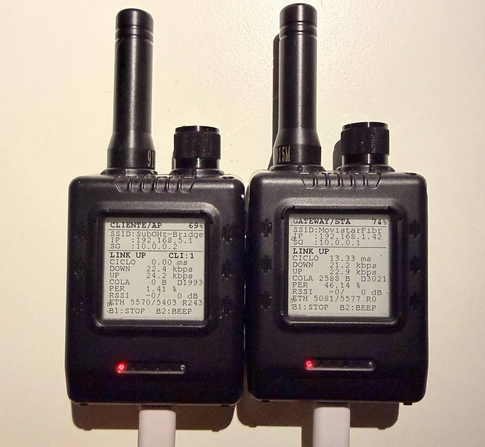
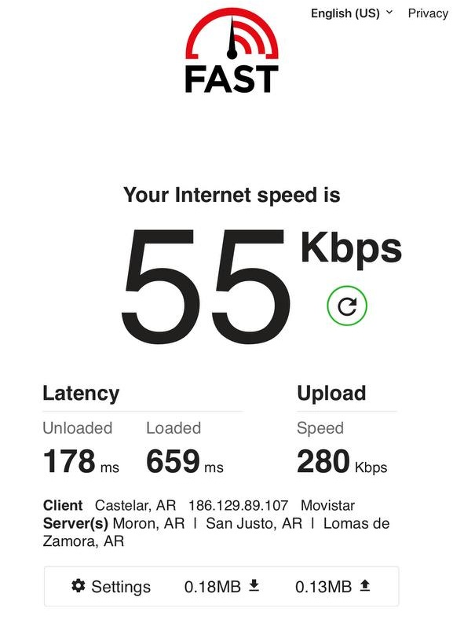

# Low Speed Internet — Sub-GHz IP Bridge

A functional **low-speed internet link** over **915 MHz GFSK** using two
ESP32-S3 + SX1262 modules (Elecrow ThinkNode M5). Achieves ~40 kbps useful
throughput — enough for WhatsApp, Telegram, and lightweight web browsing.
Think 56k modem for the 2020s.



*Two ThinkNode M5 units running the Sub-GHz bridge — one as Gateway, one as Client.*



*Real speed test result via the Sub-GHz link: 56 kbps.*

## How It Works

```
[Phone/PC] <--2.4GHz WiFi--> [Client M5] <--915 MHz GFSK--> [Gateway M5] <--2.4GHz WiFi--> [Internet Router]
  192.168.5.x     "SubGHz-Bridge"      10.0.0.0/30         192.168.1.x
```

### Two roles, same firmware

| Role | `ROLE_GATEWAY` | Function |
|------|---------------|----------|
| **Gateway** | `1` | Connects to your home WiFi (STA mode), bridges internet to the 915 MHz link |
| **Client** | `0` | Creates a WiFi AP called `SubGHz-Bridge`, bridges connected devices to the 915 MHz link |

## Hardware

- **2×** Elecrow ThinkNode M5 (ESP32-S3 + SX1262 + E-Ink display + buttons + buzzer)
- Or any ESP32-S3 board with an SX1262 radio

### ThinkNode M5 Pinout

| Function | Pin |
|----------|-----|
| SX1262 SCK | 16 |
| SX1262 MISO | 7 |
| SX1262 MOSI | 15 |
| SX1262 CS | 17 |
| SX1262 RST | 6 |
| SX1262 BUSY | 5 |
| SX1262 DIO1 | 4 |
| SX1262 PWR_EN | 46 |
| EPD SCK | 38 |
| EPD MOSI | 45 |
| EPD CS | 39 |
| EPD DC | 40 |
| Button 1 | 21 |
| Button 2 | 14 |
| Buzzer | 9 |
| Battery ADC | 8 |
| I2C SDA | 48 |
| I2C SCL | 47 |

## Radio Configuration

| Parameter | Value |
|-----------|-------|
| Frequency | 915 MHz (ISM) |
| Modulation | GFSK |
| Bit rate | 250 kbps |
| Frequency deviation | 80 kHz |
| RX bandwidth | 467 kHz |
| Preamble | 32 bits |
| TX power | 20 dBm |
| CRC | 2 bytes |
| Whitening | Enabled |
| Data shaping | BT=0.5 |
| Sync word | 4 bytes (0x9C5A3B67) |

GFSK was chosen over LoRa for speed: 250 kbps vs ~5 kbps typical with LoRa in
the same bandwidth. The SX1262 supports FSK up to 300 kbps.

## Protocol Stack

### MAC Layer (TDMA)

Time-slotted with Master (Gateway) polling:

**Master (Gateway)**:
1. Dequeue next packet fragment (or send NULL)
2. Build header: ctrl, seq, ack, RSSI, noise
3. Transmit fragment
4. Wait for ACK (up to 60ms)
5. On ACK match → advance to next fragment
6. On timeout/CRC error → retry (up to 3, then abort)

**Slave (Client)**:
1. Listen (up to 1 second)
2. On valid packet → process, build response
3. Transmit back immediately

### Packet Format

```
+--------+------+------+------+-------+------+------------------+
| CTRL   | SEQ  | ACK  | RSSI | NOISE | RSVD | PAYLOAD (0-240)  |
| (1 B)  | (1B) | (1B) | (1B) | (1B)  | (1B) | (variable)       |
+--------+------+------+------+-------+------+------------------+
         \___________ 6-byte header (SG_HDR_LEN) _______________/
```

**CTRL bits**:
- `0x40` — NULL type (no data)
- `0x00` — DATA type
- `0x20` — FIRST flag (first fragment of an Ethernet packet)
- `0x10` — MF flag (more fragments follow)

### Fragmentation

Ethernet packets (up to 1514 bytes) are split into 240-byte fragments:
- FIRST flag on the first fragment
- MF flag on intermediate fragments
- No MF on the last fragment
- Reassembly buffer: 1600 bytes
- Out-of-order FIRST resets reassembly (desync recovery)

### Custom lwIP Netif

A virtual Ethernet interface ("SG") bridges lwIP to the radio:
- `sg_transmit()`: Queues Ethernet frames from lwIP for radio transmission
- `sg_netif_start()`: Creates the netif with IP 10.0.0.x/30
- `net_rx_task()`: Receives reassembled frames and injects them into lwIP

### NAPT Configuration

| Device | NAPT Interface | Internal Net | External Net |
|--------|---------------|--------------|--------------|
| Gateway | SG (10.0.0.1) | 10.0.0.0/30 | STA (192.168.1.x) |
| Client | WIFI_AP_DEF | 192.168.5.0/24 | SG (10.0.0.2) |

## Performance

| Metric | Value |
|--------|-------|
| Radio bitrate | 250 kbps (GFSK) |
| Useful throughput | ~22-40 kbps |
| TDMA cycle | ~5-6 ms |
| Peer RTT (ICMP) | 51-68 ms |
| WAN RTT (8.8.8.8) | ~256 ms |
| PER (benchmark) | 57-65% |
| RSSI | -20 to -30 dBm |
| Noise floor | -106 to -110 dBm |
| Fragments per 1500B packet | 7 (240B each) |

## Building & Flashing

### Using Arduino CLI

```bash
# Gateway
arduino-cli compile --fqbn esp32:esp32:esp32s3 SubGHzBridge_M5_v1_2_baseline_gateway
arduino-cli upload --fqbn esp32:esp32:esp32s3 --port COM15 \
    --input-dir SubGHzBridge_M5_v1_2_baseline_gateway/build

# Client
arduino-cli compile --fqbn esp32:esp32:esp32s3 SubGHzBridge_M5_v1_2_baseline_client
arduino-cli upload --fqbn esp32:esp32:esp32s3 --port COM16 \
    --input-dir SubGHzBridge_M5_v1_2_baseline_client/build
```

### Dependencies

- **RadioLib** v7.7.1+
- **GxEPD2** v1.6.7+
- **ESP32 Arduino Core** v3.3.8+

### SDK Configuration Required

```
CONFIG_LWIP_IP_FORWARD=y
CONFIG_LWIP_IPV4_NAPT=y
```

## Serial Commands

| Command | Description |
|---------|-------------|
| `start` | Start the RF link |
| `stop` | Stop the RF link |
| `bm` | Toggle benchmark mode (dummy traffic) |
| `stats` | Show live statistics |
| `netif` | Show network interface status |
| `ping` | ICMP echo to peer (10.0.0.x) |
| `ping8` | ICMP echo to 8.8.8.8 |
| `dns` | DNS query to 8.8.8.8 |
| `wan` | DNS query bound to AP interface (client only) |
| `reset` | Reset statistics counters |
| `reboot` | Reboot the device |

## Button Controls

- **B1**: Toggle start/stop
- **B1 long press**: Reset statistics
- **B2**: Toggle beep on/off
- **B2 long press**: Run RF selftest
- **B1 + B2 >3s**: Toggle benchmark mode

## Display Shows

- Role (GATEWAY/STA or CLIENTE/AP)
- Battery percentage
- WiFi SSID and IP
- SG link IP
- Link status (LINK UP / BUSCANDO / DETENIDO / BENCHMARK)
- Connected clients count (client only)
- Cycle time, DOWN/UP kbps
- Queue depth, PER, RSSI
- Ethernet TX/RX and retransmissions

## Known Limitations

- High RTT (~250ms WAN) limits TCP window scaling and throughput
- Asymmetric PER: Gateway shows high losses, Client shows none
- No IPv6 support
- /30 subnet limits to 2 hosts (gateway + client)
